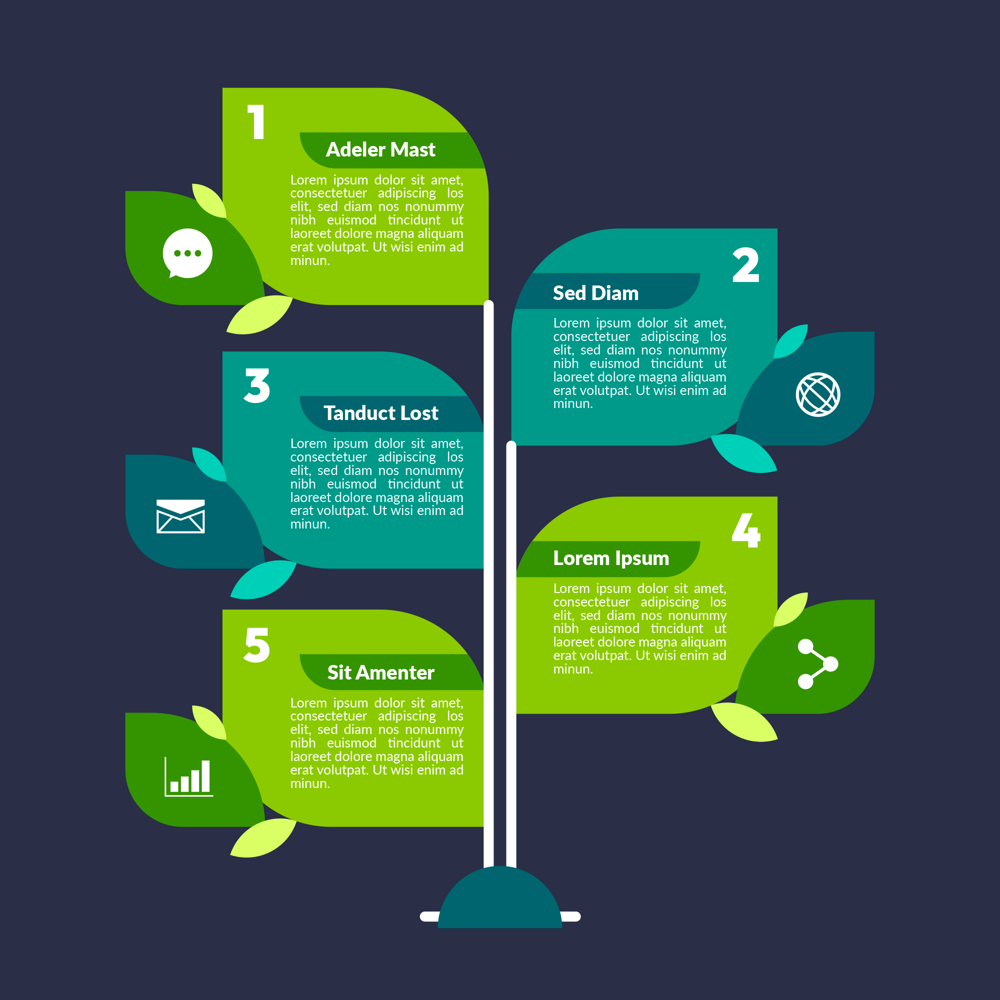

<h1 align="center" style="background-color: white; color: green; padding: 10px; border-radius: 5px; font-weight: bold; font-family: 'Arial', sans-serif;">
   
  <span style="font-family: 'Helvetica Neue', Helvetica, Arial, sans-serif;">RoofMarket</span> 
</h1>


## 🔭 *Project Description*
RoofMarket 🏠 is a modern web platform designed to revolutionize the way people interact with the real estate market. Whether you’re a property owner looking to list your property or a buyer searching for your dream home, RoofMarket simplifies the entire process. With a clean, user-friendly interface and a robust backend, it empowers users to effortlessly browse, manage, and transact properties.

- ### *What Does RoofMarket Do?*
Connects property owners with potential buyers or tenants through an intuitive property listing system.
Provides search and filter tools to help users quickly find properties that match their preferences.
Allows property owners to manage their listings, availability, and inquiries in real-time.
Enhances the property browsing experience with dynamic, visually appealing layouts and responsive design.
- ### *Technologies used*
<p align="center"> </a> <a href="https://www.linux.org/" target="_blank" rel="noreferrer">  </a> <a href="https://www.python.org" target="_blank" rel="noreferrer">  </a> <a href="https://www.mysql.com/" target="_blank" rel="noreferrer">  </a> <a href="https://www.nginx.com" target="_blank" rel="noreferrer">  </a> <a href="https://getbootstrap.com" target="_blank" rel="noreferrer">  </a> <a href="https://git-scm.com/" target="_blank" rel="noreferrer">  </a> <a href="https://www.w3schools.com/css/" target="_blank" rel="noreferrer">  </a> <a href="https://www.w3.org/html/" target="_blank" rel="noreferrer">  </a> <a href="https://developer.mozilla.org/en-US/docs/Web/JavaScript" target="_blank" rel="noreferrer">  </a>  </p>


We used Flask (Python) for its simplicity and flexibility in building scalable web applications with RESTful APIs. HTML5, CSS3, and JavaScript enable a dynamic, interactive, and user-friendly front-end experience. MySQL is chosen for its reliability and efficiency in managing and retrieving large datasets for user information and transactions
## 🛠️ Installation Steps

1. Clone the repository

```bash
git clone https://github.com/antoineleno/roofmarket.git
```

2. Change the working directory

```bash
cd roofmarket
``` 

3. Create a virtual environment

```bash
python3 -m venv myenv
```
4. Activate the virtual environment

```bash
source myenv/bin/activate
```

5. Install dependencies

```bash
npm install
```

. Change the working directory

```bash
cd web_flask
```

4. Run the app

```bash
python3 app.py
```

🌟 You are all set!

<h3 align="center">A passionate Data Scientist and Web Developer.</h3>

<h3 align="center">I warmly welcome you to explore my GitHub repository.</h3>
<p align="left">  </p>

<p align="left"> <a href="https://github.com/ryo-ma/github-profile-trophy"></a> </p>

<p align="left"> <a href="https://twitter.com/@aleno99770" target="blank"></a> </p>

- 🔭 I’m currently working on **AirBnB Project**

- 🌱 I’m currently learning **Sofware Engineering**

- 👯 I’m looking to collaborate on **web projects**

- 💬 Ask me about **Python, C, SQL**

- 📫 How to reach me **lenoantoine2000@gmail.com**

<h3 align="left">Connect with me:</h3>
<p align="left">
<a href="https://twitter.com/@aleno99770" target="blank"></a>
<a href="https://linkedin.com/in/antoine-leno-672959248" target="blank"></a>
<a href="https://kaggle.com/antoineleno" target="blank"></a>
<a href="https://fb.com/antoineleno7" target="blank"></a>
<a href="https://instagram.com/antoineleno7" target="blank"></a>
</p>


<h3 align="left">Languages and Tools:</h3>
<p align="left"> <a href="https://aws.amazon.com" target="_blank" rel="noreferrer">  </a> <a href="https://www.cprogramming.com/" target="_blank" rel="noreferrer">  </a> <a href="https://flask.palletsprojects.com/" target="_blank" rel="noreferrer">  </a> <a href="https://git-scm.com/" target="_blank" rel="noreferrer">  </a> <a href="https://www.java.com" target="_blank" rel="noreferrer">  </a> <a href="https://www.linux.org/" target="_blank" rel="noreferrer">  </a> <a href="https://www.microsoft.com/en-us/sql-server" target="_blank" rel="noreferrer">  </a> <a href="https://www.mysql.com/" target="_blank" rel="noreferrer">  </a> <a href="https://www.nginx.com" target="_blank" rel="noreferrer">  </a> <a href="https://www.photoshop.com/en" target="_blank" rel="noreferrer">  </a> <a href="https://www.python.org" target="_blank" rel="noreferrer">  </a> </p>

<h3 align="center">Description of the account.</h3>
<h4 align="center">This repository account contains descriptions of various projects.</h4>
<h5 align="center">1. Numerous software engineering projects focused on full stack web development.</h5>

<h5 align="center">2. Numerous Data Science projects focused on data analysis, machine learning, and data visualization.</h5>


<h3 align="left">Support:</h3>
<p><a href="https://www.buymeacoffee.com/antoineleno"> </a><a href="https://ko-fi.com/antoineleno"> </a></p><br><br>

<p></p>

<p>&nbsp;</p>

<p></p>


<p align="center">
  <a href="https://rahuldkjain.github.io/gh-profile-readme-generator">
    
  </a>
</p>
<h1 align="center">
  GitHub Profile README Generator
</h1>

<p align="center">
<a href="https://github.com/rahuldkjain/github-profile-readme-generator/blob/master/LICENSE" target="blank">

</a>
<a href="https://github.com/rahuldkjain/github-profile-readme-generator/fork" target="blank">

</a>
<a href="https://github.com/rahuldkjain/github-profile-readme-generator/stargazers" target="blank">

</a>
<a href="https://github.com/rahuldkjain/github-profile-readme-generator/issues" target="blank">

</a>
<a href="https://github.com/rahuldkjain/github-profile-readme-generator/pulls" target="blank">

</a>
<a href="https://discord.gg/HHMs7Eg" target="blank">

</a>
</p>

<p align="center"></p>

<p align="center">
    <a href="https://rahuldkjain.github.io/gh-profile-readme-generator" target="blank">View Demo</a>
    ·
    <a href="https://github.com/rahuldkjain/github-profile-readme-generator/issues/new/choose">Report Bug</a>
    ·
    <a href="https://github.com/rahuldkjain/github-profile-readme-generator/issues/new/choose">Request Feature</a>
</p>

<p align="center">
<i>Loved the tool? Please consider <a href="https://paypal.me/rahuldkjain/10">donating</a>  💸 to help it improve!</i>
</p>

<p align="center">
<a href="https://www.paypal.me/rahuldkjain">
</a>
<a href='https://ko-fi.com/A0A81XXSX' target='_blank'>
</a>
<a href="https://www.buymeacoffee.com/rahuldkjain" target="_blank">
</p>

#### Tired of editing GitHub Profile README with new features?

This tool provides an easy way to create a GitHub profile readme with the latest add-ons such as `visitors count`, `github stats`, etc.

## 🚀 Demo

<a href="https://rahuldkjain.github.io/gh-profile-readme-generator" target="blank">

</a>

Try the tool: [GitHub Profile README Generator](https://rahuldkjain.github.io/gh-profile-readme-generator)

## 🧐 Features

Just fill in the details such as `Name`, `Tagline`, `Dev Platforms Username`, `Current Work`, `Portfolio`, `Blog`, etc. with a minimal UI.

- **Uniform Dev Icons**

- **Uniform Social Icons**

- **Visitors Counter Badge**

- **GitHub Profile Stats Card**

- **GitHub Top Skills**

- **GitHub Streak Stats**

- **Dynamic Dev(.)to Blogs** (GitHub Action)

- **Dynamic Medium Blogs** (GitHub Action)

- **Dynamic Personal Blogs from RSS Feed** (GitHub Action)

- **Wakatime Stats** [contribute](https://github.com/rahuldkjain/github-profile-readme-generator/issues/115)

- **Buy Me A Coffee button**

Click on `Generate README` to get your README in `markdown`.
You can preview the README too.

## 🛠️ Installation Steps

1. Clone the repository

```bash
git clone https://github.com/rahuldkjain/github-profile-readme-generator.git
```

2. Change the working directory

```bash
cd github-profile-readme-generator
```

3. Install dependencies

```bash
npm install
```

4. Run the app

```bash
npm start
```
## 🙇 Special Thanks

- [Anurag Hazra](https://github.com/anuraghazra) for amazing [github-readme-stats](https://github.com/anuraghazra/github-readme-stats)
- [Anton Komarev](https://github.com/antonkomarev) for super cool [github-profile-views-counter](https://github.com/antonkomarev/github-profile-views-counter)
- [Gautam Krishna R](https://github.com/gautamkrishnar) for the awesome [blog post workflow](https://github.com/gautamkrishnar/blog-post-workflow)
- [Jonah Lawrence](https://github.com/DenverCoder1) for the incredible [github-readme-streak-stats](https://github.com/DenverCoder1/github-readme-streak-stats)
- [Julien Monty](https://github.com/konpa) for super useful [devicon](https://github.com/konpa/devicon)
- [Eliot Sanford](https://github.com/techieeliot) for adding hashnode as a blog input
🌟 You are all set!

## 🍰 Contributing

Please contribute using [GitHub Flow](https://guides.github.com/introduction/flow). Create a branch, add commits, and [open a pull request](https://github.com/rahuldkjain/github-profile-readme-generator/compare).

Please read [`CONTRIBUTING`](CONTRIBUTING.md) for details on our [`CODE OF CONDUCT`](CODE_OF_CONDUCT.md), and the process for submitting pull requests to us.

## 💻 Built with

- [Gatsby](https://www.gatsbyjs.com/)
- [Tailwind CSS](https://tailwindcss.com/): for styling
- [GSAP](https://greensock.com/gsap/): for small SVG Animations

## 🙇 Special Thanks

- [Anurag Hazra](https://github.com/anuraghazra) for amazing [github-readme-stats](https://github.com/anuraghazra/github-readme-stats)
- [Anton Komarev](https://github.com/antonkomarev) for super cool [github-profile-views-counter](https://github.com/antonkomarev/github-profile-views-counter)
- [Gautam Krishna R](https://github.com/gautamkrishnar) for the awesome [blog post workflow](https://github.com/gautamkrishnar/blog-post-workflow)
- [Jonah Lawrence](https://github.com/DenverCoder1) for the incredible [github-readme-streak-stats](https://github.com/DenverCoder1/github-readme-streak-stats)
- [Julien Monty](https://github.com/konpa) for super useful [devicon](https://github.com/konpa/devicon)
- [Eliot Sanford](https://github.com/techieeliot) for adding hashnode as a blog input

## 🙇 Sponsors

- [Scott C Wilson](https://github.com/scottcwilson) donated the first-ever grant to this tool. A big thanks to him.
- [Max Schmitt](https://github.com/mxschmitt) loved the tool and showed support with his donation. Thanks a lot.
- [Aadit Kamat](https://github.com/aaditkamat) find the tool useful and showed support with his donation. A big thanks to him.
- [Jean-Michel Fayard](https://github.com/jmfayard) used the generator to create his GitHub Profile README and he loved it. Thanks to him for showing support to the tool with the donation.

## 🙏 Support

<p align="left">
<a href="https://www.paypal.me/rahuldkjain/10">
</a>
<a href="https://twitter.com/intent/tweet?text=Wow:&url=https%3A%2F%2Frahuldkjain.github.io%2Fgithub-profile-readme-generator">

</a>
</p>

<p align="left">
  <a href='https://ko-fi.com/A0A81XXSX' target='_blank'>
  </a>
  <a href="https://www.buymeacoffee.com/rahuldkjain" target="_blank">
</p>

<hr>
<p align="center">
Developed with ❤️ in India 🇮🇳 
</p>
